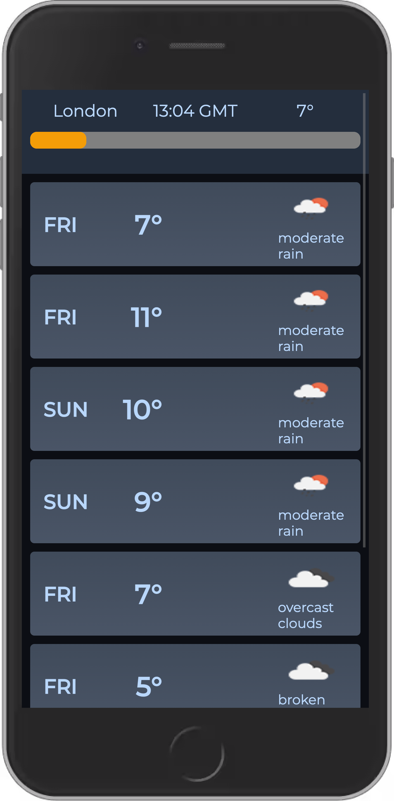
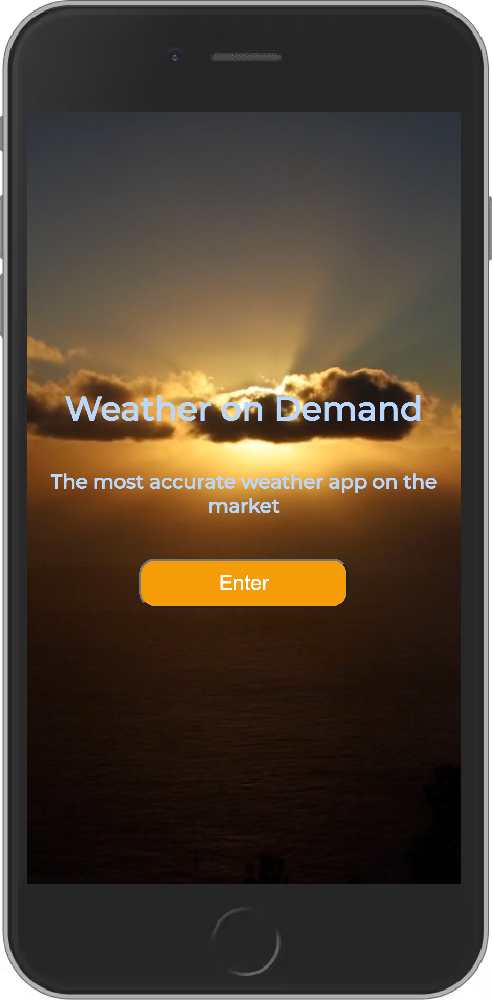

  
  
 

# WEATHER APP

A front-end React application consuming the Open Weather API.

Users are able to access a 5 day forecast for London GMT timezone.
The forecast updates itself every 60seconds and refreshes, for the most up to date weather forecast!

# How to Use

- Step 1: Clone the repo ☝🏼
- Step 2: `cd weather && npm install`
- Step 3: Hit `npm start`
- Step 4: Enjoy the weather!

## Tech Stack

- [React](https://reactjs.org/)

## Author

- Ritam Verma - [GitHub](https://github.com/ritammv) - [LinkedIn](https://www.linkedin.com/in/ritammv)
